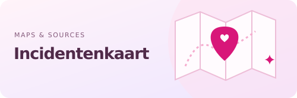
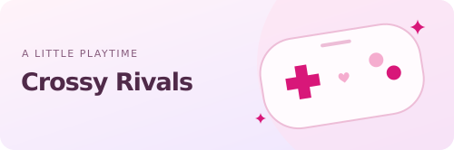
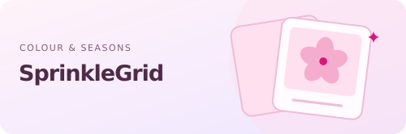
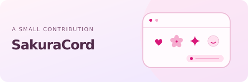

<picture><source media="(prefers-color-scheme: dark)" srcset="./assets/header-dark.svg"></picture>

I like having my own little corner of the internet — and making it feel like mine.

My background is in <b>domains, DNS and email</b>. 
Outside that: self-hosting, websites, small tools and the occasional game.

<picture><source media="(prefers-color-scheme: dark)" srcset="./assets/divider-dark.svg"></picture>

<h3 align="center">a few things from my corner 🌷</h3>

<table width="100%">
<tr>
<td width="50%" valign="top">
<a href="https://incidentenkaart.nl"><picture><source media="(prefers-color-scheme: dark)" srcset="./assets/incidents-dark.svg"></picture></a>

Public incident reports in the Netherlands, brought together on a map. Traceable sources, related reports and room for uncertainty.

</td>
<td width="50%" valign="top">
<a href="https://crossyrivals.com"><picture><source media="(prefers-color-scheme: dark)" srcset="./assets/crossy-dark.svg"></picture></a>

A browser game inspired by Crossy Road. Hop through traffic on your own or play with friends, with multiplayer lobbies and shared rounds.

</td>
</tr>
<tr>
<td width="50%" valign="top">
<a href="https://sprinklegrid.nl"><picture><source media="(prefers-color-scheme: dark)" srcset="./assets/sprinkle-dark.svg"></picture></a>

A colourful gallery experiment with seasonal themes. A small place for colour and a change of scenery.

</td>
<td width="50%" valign="top">
<a href="https://github.com/SakuraCordApp/SakuraCord/pull/22"><picture><source media="(prefers-color-scheme: dark)" srcset="./assets/sakura-dark.svg"></picture></a>

A pull request to show which server a custom emoji comes from, right in the picker. One little improvement to an app I use.

</td>
</tr>
</table>

<picture><source media="(prefers-color-scheme: dark)" srcset="./assets/divider-dark.svg"></picture>

The projects featured here were developed with AI handling the coding. My role: shaping the ideas, deciding how things should behave, testing and refining the results. My earlier websites started with existing Jekyll themes that I customised by hand.

Usually somewhere between DNS, self-hosting, privacy, games and “can I make this a little nicer?” ♡

